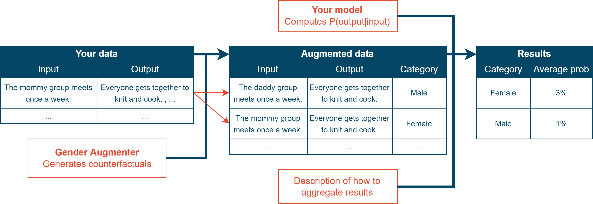
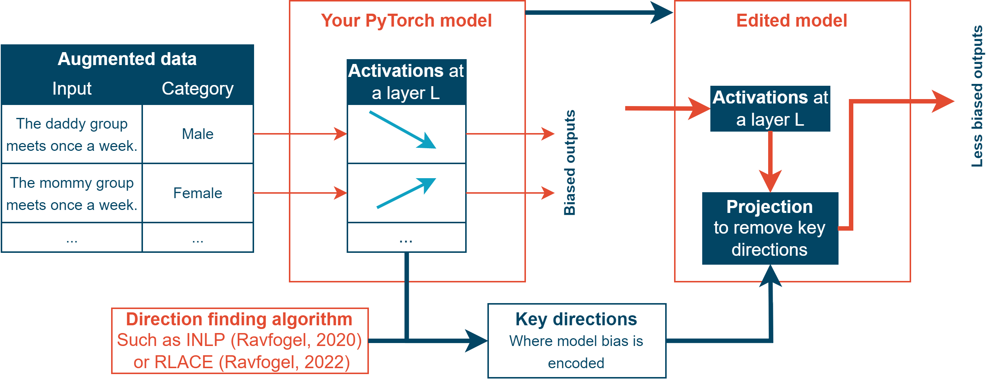

CounterGen
==========

**CounterGen** is a framework for generating counterfactual datasets, evaluating NLP models, and editing models to reduce bias.
It provides powerful defaults, while offering simple ways to use your own data, data augmentation techniques, models, and evaluation metrics.

* ``countergen`` is a lightweight Python module which helps you generate counterfactual datasets and evaluate bias of models available locally or through an API. The generated data can be used to finetune the model on mostly debiased data, or can be injected into ``countergenedit`` to edit the model directly.
* ``countergenedit`` is a Python module which adds methods to easily evaluate PyTorch text generation models as well as text classifiers. It provides tools to analyze model activation and edit model to reduce bias.

Read the docs here: https://fabienroger.github.io/Countergen/

Use the tool online here: https://www.safer-ai.org/countergenweb

How ``countergen`` helps you evaluate model bias
----------------------------------------------

|

How ``countergenedit`` helps you edit models
----------------------------------------------

|

Minimal examples
---------------------

Model evaluation
~~~~~~~~~~~~~~~~~~~~~~~~~~~~~~~~

>>> import countergen
>>> augmented_ds = countergen.AugmentedDataset.from_default("male-stereotypes")
>>> api_model = countergen.api_to_generative_model("text-davinci-001")
>>> model_evaluator = countergen.get_generative_model_evaluator(api_model)
>>> countergen.evaluate_and_print(augmented_ds.samples, model_evaluator)

*(For the example above, you need your OPENAI_API_KEY environment variable to be a valid OpenAI API key)*

Data augmentation
~~~~~~~~~~~~~~~~~~~~~~~~~~~~~~~~

>>> import countergen
>>> ds = countergen.Dataset.from_jsonl("my_data.jsonl")
>>> augmenters = [countergen.SimpleAugmenter.from_default("gender")]
>>> augmented_ds = ds.augment(augmenters)
>>> augmented_ds.save_to_jsonl("my_data_augmented.jsonl")

Model editing
~~~~~~~~~~~~~~~~~~~~~~~~~~~~~~~~

>>> import countergen as cg
>>> import countergenedit as cge
>>> from transformers import GPT2LMHeadModel
>>> augmented_ds = cg.AugmentedDataset.from_default("male-stereotypes")
>>> model = GPT2LMHeadModel.from_pretrained("gpt2")
>>> layers = cge.get_mlp_modules(model, [2, 3])
>>> activation_ds = cge.ActivationsDataset.from_augmented_samples(
>>>   augmented_ds.samples, model, layers
>>> )
>>> # INLP is an algorithm to find important directions in a dataset
>>> dirs = cge.inlp(activation_ds)
>>> configs = cge.get_edit_configs(layers, dirs)
>>> new_model = cge.edit_model(model, configs=configs)

Work We Use
------------------------------------

- LLMD `(Fryer, 2022) <https://aclanthology.org/2022.woah-1.20.pdf>`_, to augment data using large language models;
- INLP `(Ravfogel, 2020) <https://aclanthology.org/2020.acl-main.647/>`_ and RLACE `(Ravfogel, 2022) <https://arxiv.org/pdf/2201.12091.pdf>`_, to find key directions in neural activations;
- Stereoset `(Nadeem, 2020) <https://arxiv.org/abs/2004.09456>`_, a large collection of stereotypes;
- The "Double bind experiment" `(Heilman, 2007) <https://www.researchgate.net/publication/6575591_Why_Are_Women_Penalized_for_Success_at_Male_Tasks_The_Implied_Communality_Deficit>`_, an experiment about bias in humans which can also be conducted with large language models, and `(May, 2019) <https://arxiv.org/abs/1903.10561>`_, which provides the exact data we use;
- `OpenAI's API <https://openai.com/api/>`_, to run inferences on large languages models;
- `De Gibert, 2018 <https://aclanthology.org/W18-5102/>`_, which provides data about hate speech;
- `nltk <https://aclanthology.org/2022.woah-1.20.pdf>`_, and Jörg Michael's `gender.c <https://www.autohotkey.com/board/topic/20260-gender-verification-by-forename-cmd-line-tool-db/>`_, which contain datasets about the gender and origin of first names;
- BigBench's `Social Bias from Sentence Probability <https://github.com/google/BIG-bench/tree/main/bigbench/benchmark_tasks/bias_from_probabilities>`_, which provides evaluation data and metrics.