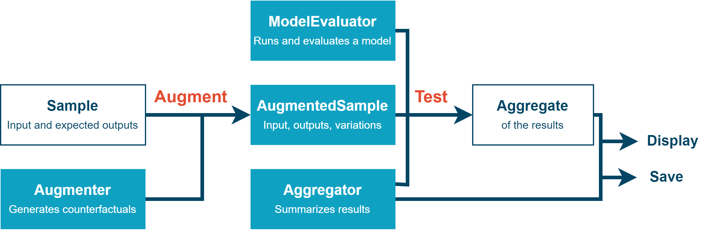

Usage
====================

.. _installation:

Installation
------------

To use CountergenTorch, first install it using pip:

.. code-block:: console

   (.venv) $ pip install countergen

Diagram of How Evaluation Works
---------------------------------------

.. image:: ../countergen_explanation.png
  :width: 700
  :align: center
  :alt: Evaluation worflow

|

Abstract Workflow
-------------------

|

Outline of the evaluation process
------------------------------------------------

Data Augmentation
~~~~~~~~~~~~~~~~~~~~~~~

First, you produce a list of :py:class:`AugmentedSample`, either by loading an existing one, or using tools the library provides to build you it from raw data, or by creating your own from scratch.

.. autoclass:: countergen.AugmentedSample
   :members: input, outputs, get_variations

Where a :py:class:`Variation` is defined as follows.

.. autoclass:: countergen.Variation
   :members: text, categories
   :member-order: bysource

Model Loading
~~~~~~~~~~~~~~~~~~~~~~~

Second, you load your model and turn it into a :py:data:`ModelEvaluator`, which is just a callable that returns the performance of a model given an input and expected outputs.

Model Evaluation
~~~~~~~~~~~~~~~~~~~~~~~

Third, you pass your list of :py:class:`AugmentedSample` and your :py:data:`ModelEvaluator` into the following function:

.. autofunction:: countergen.evaluate
   :noindex:

By default, it will return the average performance on each kind of data. You can specify other ways to aggregate the performance on each variation by passing another :py:class:`Aggregator`.

Alternatively, if you just want to print or save the results, directly :py:func:`evaluate_and_print` or :py:func:`evaluate_and_save`

And that's it! ``countergen`` and ``countergenedit`` provide powerful ways to generate variations, load models easily, and edit them to decrease performance gaps between different categories. Click on *Next* to know more.
