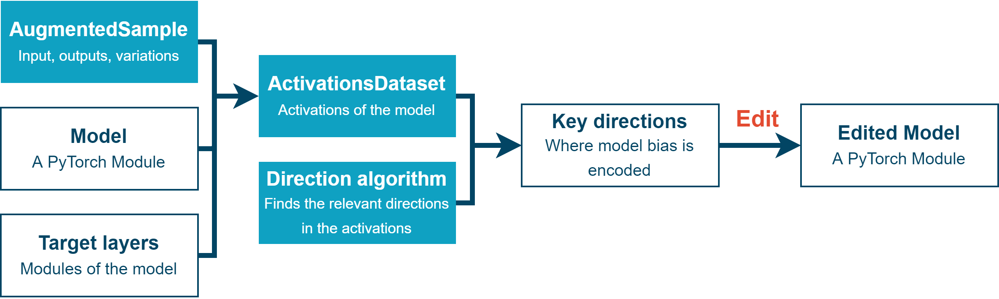

Usage
====================

Installation
------------

To use CounterGen, first install it using pip:

.. code-block:: console

   (.venv) $ pip install countergenedit

Diagram of How Editing Works
-----------------------------

.. image:: ../countergenedit_explanation.png
  :width: 700
  :align: center
  :alt: Evaluation worflow
|

Abstract Workflow
-------------------

|

Outline of the editing process
------------------------------------------------

PyTorch Model Loading
~~~~~~~~~~~~~~~~~~~~~~~

To be able to edit the models, you need to have the model stored locally because the most common APIs don't allow users to have access to internal activations and don't let you edit the weights.

This library provides tools to evalute and edit PyTorch models. First, load your PyTorch module. Then, you will be able to evalute it by turning it into a :py:data:`ModelEvaluator` using one of the following:

* :py:func:`pt_to_generative_model` and :py:func:`get_generative_model_evaluator` to evalute generative models
* :py:func:`get_classification_model_evaluator` to evalute classification models

Measuring Internal Bias
~~~~~~~~~~~~~~~~~~~~~~~

Then, to know where to do the editing, you need to know what's different in the inner workings of the model between different categories.

Once you have generated variations of your data using ``countergen``, :py:class:`ActivationsDataset` provides some utilities to measure the inner activations of the model, and gives you a PyTorch dataset of (activations, category) pairs. You can also do that manually using other utilities if you want a more fine grained measurements.

Finding the Relevant Directions 
~~~~~~~~~~~~~~~~~~~~~~~~~~~~~~~~

Based on those measurements, you want to extract the relevant places where the model stores differences between the categories.

A natural way to do so is to find "features": linear combinations of neurons which have been found to often capture the human understandable concepts we care about. We provide three methods to allow you to find the directions most relevant to the concept that's different between one category and another, which all have some advantages and disadvantages:

* INLP by Ravfogel, 2020: see https://aclanthology.org/2020.acl-main.647/
* RLACE by Ravfogel, 2022: see https://arxiv.org/pdf/2201.12091.pdf
* Span of an MLP classifier.

More details about each methods can be found in the :ref:`relevant section <Finding the Relevant Directions>`:.

Editing the Model
~~~~~~~~~~~~~~~~~~~~~~~~~~~~~~~~

Once you have compute the relevant directions, you can easily produce a modification configuration using :py:func:`get_edit_configs` and edit the model using :py:func:`edit_model`, which will give you a new model that projects activations during the forward pass to remove most of the distinction your model makes between the differents categories of data you want your model to treat as equals.

And that's it! Now you can evaluate your model again by using ``countergen``, and export your model as you would export any PyTorch model.
